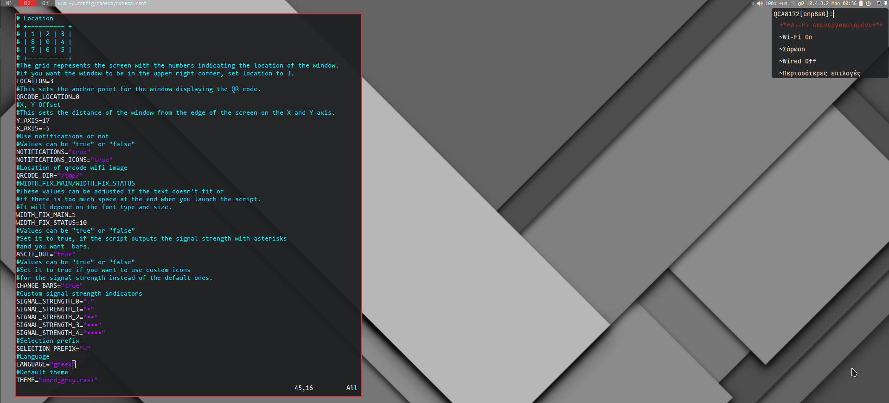

# ronema - Rofi-Network-manager
A Network manager for Tiling Window Managers [i3/bspwm/awesome/etc] or not.

Inspired from [rofi-wifi-menu](https://github.com/zbaylin/rofi-wifi-menu).
## Table of Contents

- [Requirements](#requirements)
- [Features](#features)
- [Screenshots](#screenshots)
- [Config](#config)
- [Languages](#language-localization)
- [Download-Usage](#download-usage)
- [Instalationn](#installing-uninstalling-and-updating-ronema)
- [Themes](#themes)
- [Examples-Usage](#examples-usage)
- [ToDo](#todo)

### Requirements

- **NetworkManager** (_nmcli_)
- [**rofi**](https://github.com/davatorium/rofi)
- **Notification Daemon** (_Optional_) (_For notifications_)
  - [notify-osd](https://launchpad.net/notify-osd)
  - [dunst](https://github.com/dunst-project/dunst)
  - [fnott](https://codeberg.org/dnkl/fnott)
- **nm-connection-editor** (_Optional_) (_For editing connections_)
- [**qrencode**](https://fukuchi.org/works/qrencode) (_Optional_) (_For sharing wifi with qrcode_)

### Features

- Connect to an existing network.
- Disconnect from the network.
- Turn on/off wifi.
- Support for Multiple wifi devices.
  - Option to change between wifi devices when available.
- Manual Connection to a Access Point or a hidden one.
- Turn on/off ethernet.
  - See when ethernet is unavailable.
- Restart the network.
- Status
  - See devices Connection name and local IP.
- See Current wifi password and share it with a qrcode.
- Connect to pre-configured VPNs.
- Change the defualt signal strength bars with anything you want.
- Support for language localization based on configuration file.

### Screenshots




### Config

<details> 
 <summary>ronema.conf</summary>


```
# Location
# +---------- +
# | 1 | 2 | 3 |
# | 8 | 0 | 4 |
# | 7 | 6 | 5 |
# +-----------+
#The grid represents the screen with the numbers indicating the location of the window.
#If you want the window to be in the upper right corner, set location to 3.
LOCATION=0
#This sets the anchor point for the window displaying the QR code.         
QRCODE_LOCATION=$LOCATION 
#X, Y Offset
#This sets the distance of the window from the edge of the screen on the X and Y axis.
Y_AXIS=0
X_AXIS=0
#Use notifications or not
#Values can be "true" or "false"
NOTIFICATIONS="false"
NOTIFICATIONS_ICONS="false"
#Location of qrcode wifi image
QRCODE_DIR="/tmp/"
#WIDTH_FIX_MAIN/WIDTH_FIX_STATUS 
#These values can be adjusted if the text doesn't fit or
#if there is too much space at the end when you launch the script.
#It will depend on the font type and size.
WIDTH_FIX_MAIN=1
WIDTH_FIX_STATUS=10
#Values can be "true" or "false"
#Set it to true, if the script outputs the signal strength with asterisks
#and you want  bars.
ASCII_OUT="false"
#Values can be "true" or "false"
#Set it to true if you want to use custom icons
#for the signal strength instead of the default ones.
CHANGE_BARS="false"
#Custom signal strength indicators
SIGNAL_STRENGTH_0="0"
SIGNAL_STRENGTH_1="1"
SIGNAL_STRENGTH_2="12"
SIGNAL_STRENGTH_3="123"
SIGNAL_STRENGTH_4="1234"
#Selection prefix
SELECTION_PREFIX="~"
#Language
LANGUAGE="english"
#Default theme
THEME="ronema.rasi"
```
</details>

### Language Localization

To localize Rofi-NetWork-manager to your preferred language:

1. **Create a New Language File**: Duplicate `lang_file.example` and rename it to match your language (e.g., `french.lang`).

2. **Translate Strings**: Open the new language file (`french.lang`) and translate all strings to your language.

3. **Save the File**: Save your translated language file in `/languages`.

4. **Select the Language**: In `ronema.conf`, set `LANGUAGE` to your language file's name (without extension).

### Download-Usage

```bash
git clone --depth 1 --branch master https://github.com/P3rf/rofi-network-manager.git
cd rofi-network-manager
./src/ronema
```

### Installing, Uninstalling, and Updating ronema

To install ronema, run the following command:

```bash
./setup.sh install
```
> **Note:** This will only install ronema, not its dependencies. Please refer to the [Requirements](#requirements) section and ensure all dependencies are installed.

To uninstall ronema, you can use the following command:

```bash
./setup.sh uninstall [--remove_config]
```

The `--remove_config` flag is optional. If provided, it will remove the configuration files along with the program.

To update ronema, run:

```bash
./setup.sh update [--override_conf]
```

The `--override_conf` flag is optional. If provided, it will override the existing configuration file during the update process.

Configuration files will be located at `~/.config/ronema`.

### Themes

Rofi themes for ronema are located in the `src/themes` directory, or if installed, in `~/.config/ronema/themes`. Available themes at the moment are:

- `nord.rasi`
- `ronema_grey.rasi`
- `ronema.rasi`

You can create your own Rofi theme for ronema and set it in the configuration file (`ronema.conf`) by changing the `THEME` option.


### Examples-Usage

<details> 
 <summary>Polybar modules</summary>

```
[module/wireless-network]
type = internal/network
interface = wlan0
interval = 3.0
unknown-as-up = true
format-connected-background = ${colors.background}
format-connected-foreground = ${colors.foreground}
format-connected-padding = 1
format-connected = %{A1:ronema:}<ramp-signal> <label-connected>%{A}
label-connected = %essid%/%local_ip%
format-disconnected-background = ${colors.background}
format-disconnected-foreground = ${colors.foreground}
format-disconnected-padding = 1
format-disconnected = %{A1:ronema:}<label-disconnected>%{A}
label-disconnected =""
ramp-signal-0 = "󰤯"
ramp-signal-1 = "󰤟"
ramp-signal-2 = "󰤢"
ramp-signal-3 = "󰤥"
ramp-signal-4 = "󰤨"
ramp-signal-foreground = ${colors.white}
```

```
[module/wired-network]
type = internal/network
interface = eth0
interval = 3.0
format-connected-background = ${colors.background}
format-connected-foreground = ${colors.foreground}
format-connected-padding = 1
format-connected = %{A1:ronema:}<label-connected>%{A}
label-connected =  %local_ip%
format-disconnected-background = ${colors.background}
format-disconnected-foreground = ${colors.foreground-alt}
format-disconnected-padding = 1
format-disconnected = %{A1:ronema:}<label-disconnected>%{A}
label-disconnected ="󰌺"
```
</details>

### ToDo

- [x] Fix notifications
- [x] Add notifications icons
- [x] Support for multiple wifi devices
- [ ] Add Hotspot support
- [x] Share wifi password with qrcode inside rofi
- [x] Find a way to manage duplicate Access Points
