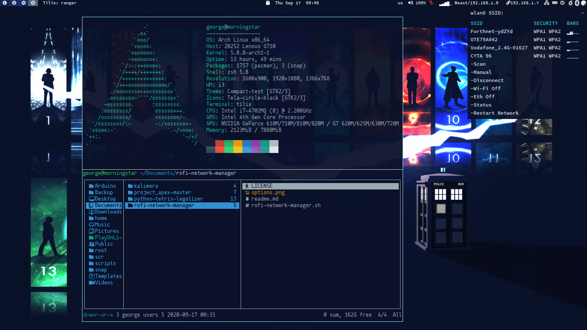
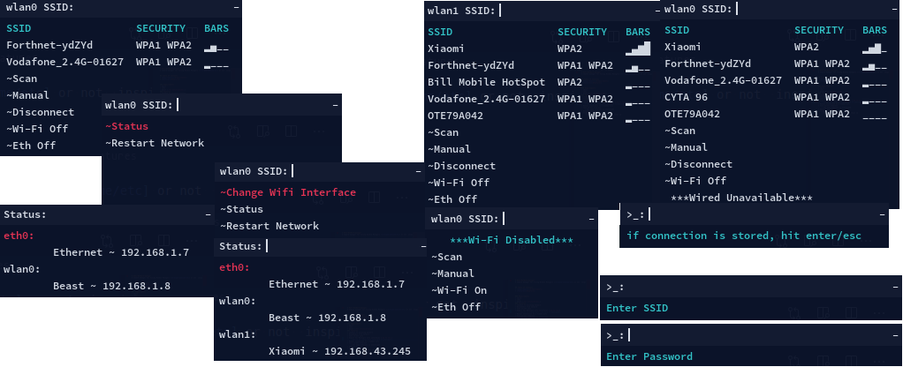

# Rofi-NetWork-manager

A nework manager for Tiling Window Managers [i3/bspwm/awesome/etc] or not.
Inspired from [rofi-wifi-menu](https://github.com/zbaylin/rofi-wifi-menu).

## Table of Contents

* [Requirements](#requirements)
* [Features](#features)
* [Screenshots](#screenshots)
* [Config](#config)
* [Download-Usage](#download-usage)
* [Examples-Usage](#examples-usage)
* [ToDo](#todo)

### Requirements

* nmcli
* [rofi](https://github.com/davatorium/rofi)
* [dunst](https://github.com/dunst-project/dunst) (_Optional_) (_For notifications_)
* [qrencode](https://fukuchi.org/works/qrencode) (_For sharing wifi with qrcode_)

### Features

* Connect to an existing network
* Disconnect from the network
* Turn on/off wifi
* Support for Multiple wifi devices
  * Option to change between wifi devices when available
* Manual Connection to a Access Point or a hidden one
* Turn on/off ethernet
  * See when ethernet is unavailable
* Restart the network
* Status
  * See devices Connection name and local IP
* See Current wifi password and share it with a qrcode

### Screenshots




### Config

__rofi-network-manager.conf__

````
# Location
#This sets the anchor point:
# +---------- +
# | 1 | 2 | 3 |
# | 8 | 0 | 4 |
# | 7 | 6 | 5 |
# +-----------+
#If you want the window to be in the upper right corner, set location to 3.
LOCATION=0
QRCODE_LOCATION=$LOCATION
#X, Y Offset
Y_AXIS=0
X_AXIS=0
#Use notifications or not
# Values on / off
NOTIFICATIONS_INIT="off"
#Location of qrcode wifi image
QRCODE_DIR="/tmp/"
# WIDTH_FIX_MAIN and WIDTH_FIX_STATUS needs to be increased by a little if the text
# doesn't fit when you launch rofi-network-manager.
#It depends on the font type and size.
WIDTH_FIX_MAIN=8
WIDTH_FIX_STATUS=14
````

__rofi-network-manager.rasi__

````
font: "DejaVu Sans Mono 9";       //Font
//Colors
foreground:#f8f8f2;               //Text
background:#0A1229;               //Background
accent:#00BCD4;                   //Hightlight
foreground-selection:@foreground; //Selection_fg
background-selection:#e34039;     //Selection_bg
````

### Download-Usage

```
git clone https://github.com/P3rf/rofi-network-manager.git
cd rofi-network-manager
bash "./rofi-network-manager.sh"
```

### Examples-Usage

**Polybar modules**

```
[module/wireless-network]
type = internal/network
interface = wlan0
interval = 3.0
unknown-as-up = true
format-connected-background  = ${colors.background}
format-connected-foreground  = ${colors.foreground}
format-connected-padding = 1
format-connected = %{A1:$HOME/.../rofi-network-manager/rofi-network-manager.sh:}<ramp-signal> <label-connected>%{A}
label-connected = %essid%/%local_ip%
format-disconnected-background  = ${colors.background}
format-disconnected-foreground = ${colors.foreground}
format-disconnected-padding = 1
format-disconnected = %{A1:$HOME/.../rofi-network-manager/rofi-network-manager.sh:}<label-disconnected>%{A}
label-disconnected =""
ramp-signal-0 = "󰤯"
ramp-signal-1 = "󰤟"
ramp-signal-2 = "󰤢"
ramp-signal-3 = "󰤥"
ramp-signal-4 = "󰤨"
ramp-signal-foreground = ${colors.white}
```

```
[module/wired-network]
type = internal/network
interface = eth0
interval = 3.0
format-connected-background  = ${colors.background}
format-connected-foreground  = ${colors.foreground}
format-connected-padding = 1
format-connected = %{A1:$HOME/.../rofi-network-manager/rofi-network-manager.sh:}<label-connected>%{A}
label-connected =  %local_ip%
format-disconnected-background  = ${colors.background}
format-disconnected-foreground = ${colors.foreground-alt}
format-disconnected-padding = 1
format-disconnected = %{A1:$HOME/.../rofi-network-manager/rofi-network-manager.sh:}<label-disconnected>%{A}
label-disconnected ="󰌺"
```

### ToDo

* [X] Fix notifications
* [ ] ~~Add notifications icons~~
* [X] Support for multiple wifi devices
* [ ] Add Hotspot support
* [X] Share wifi password with qrcode inside rofi
* [ ] Find a way to manage duplicate Access Points
